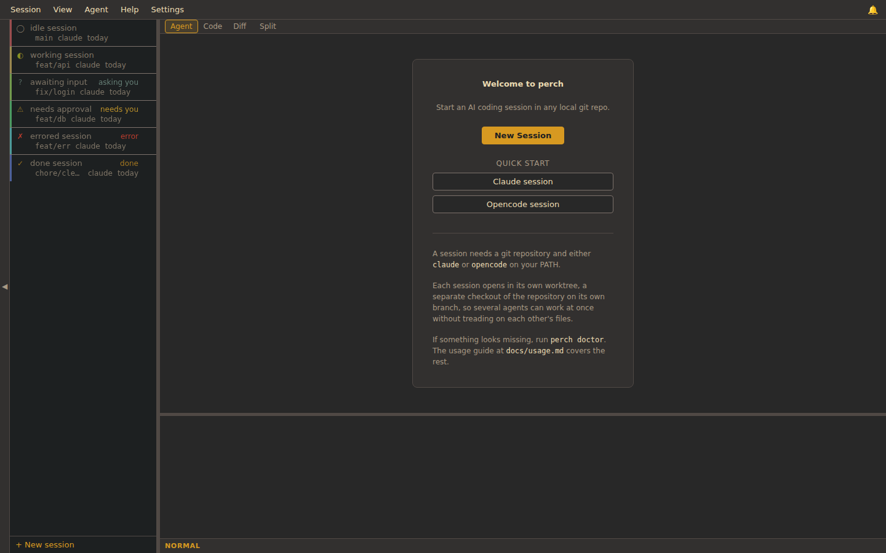
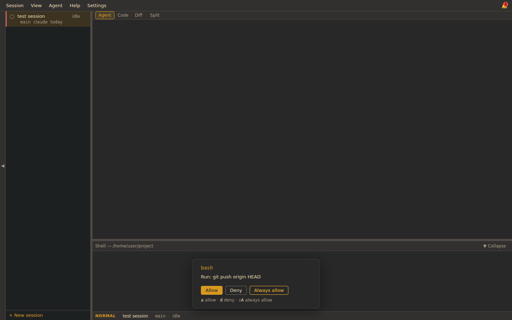
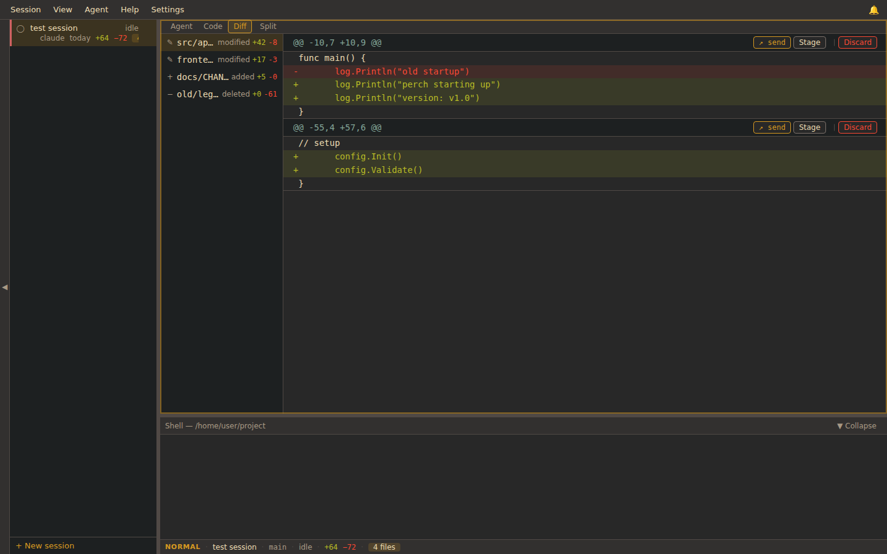

# perch

Perch gives every coding agent its own branch, its own worktree, and its own
terminal. Perch gathers the agents into one window. You can watch the work
and step in when it matters.

Perch is a desktop cockpit for the `claude` and `opencode` coding agents.
Each session is a real git worktree with a live terminal. Each session also
has a diff view with hunk-level staging, a file tree, and inline approval for
the tool calls an agent wants to run. You can drive several agents at once
and move between them without losing your place.

Perch is a single static binary. There is no tmux, no daemon, and no
background server. The Svelte frontend talks to the Go backend through Wails
bindings and events, not HTTP, so a release build opens no network port of
its own. Perch runs two local listeners: one per active Claude session, and
one for `perch reload`. Both are loopback-only and token-gated. See
[Security](#security).

Perch runs on Linux. Perch depends on WebKit2GTK and GTK3, two Linux
libraries. macOS and Windows are out of scope for now.







<!--
Maintainer note: the end-to-end screenshot sweep captures the three images
above. The sweep renders the real Svelte UI, but without a live pty, so the
terminal panes read as empty. The images show the chrome honestly: the
sidebar states, the approval card, and the diff. They do not show a working
agent. Before the public launch, capture a hero screenshot from a real
`make gui-build` run with an agent mid-task in the terminal, and place it
first. Do not fabricate one.
-->

## What you get

- **A worktree per session.** Every session is a `git worktree` on its own
  branch. Agents work in isolation and never disturb your main checkout. You
  can also run a session in the repository itself, without a separate worktree.
- **A live terminal per pane.** Each terminal is xterm.js over a direct
  pseudo-terminal the Go backend spawns. The agent runs inside it. No
  multiplexer sits in between.
- **Glanceable status.** The sidebar tells you, at a glance, which agent is
  working, which is done, which hit an error, and which is waiting on you.
- **Inline approvals.** When Claude asks to run a tool, perch blocks it and
  shows you the request. You allow it once, allow it always, or deny it.
  opencode runs its own approval prompt in its terminal. For opencode, perch
  stands back and only lights the sidebar to tell you a decision is waiting.
- **A diff you can act on.** Stage or discard individual hunks, or send a hunk
  back to the agent, without leaving the window.
- **Desktop notifications.** When the window is in the background and an agent
  needs you or fails, your desktop tells you.

Perch is the cockpit around the agents, not a replacement for them. The agents
stay the intelligence and your editor stays your editor.

## Requirements

| Need | Detail |
|------|--------|
| Operating system | Linux |
| System libraries | WebKit2GTK 4.1 (WebKitGTK 2.40 or newer) and GTK3 |
| git | any recent version |
| An agent | `claude` or `opencode` on your `PATH` (at least one) |

Install the system libraries on Debian or Ubuntu:

```sh
sudo apt install -y build-essential pkg-config libgtk-3-dev libwebkit2gtk-4.1-dev
```

`libwebkit2gtk-4.1-dev` pulls in `libsoup-3.0-dev`. WebKit2GTK 4.0 is end of
life, so perch links 4.1. The 4.1 API arrived in WebKitGTK 2.40. That release
is the minimum. Anything newer on the 4.1 line works.

## Install and run

### Download a release

Once perch tags `v0.1.0`, each
[GitHub Release](https://github.com/miniature-pug/perch/releases) attaches a
prebuilt `perch-linux-amd64` binary and a `SHA256SUMS` file. Download both
files, then run:

```sh
curl -LO https://github.com/miniature-pug/perch/releases/latest/download/perch-linux-amd64
curl -LO https://github.com/miniature-pug/perch/releases/latest/download/SHA256SUMS
sha256sum --check --ignore-missing SHA256SUMS
chmod +x perch-linux-amd64
./perch-linux-amd64
```

Each release also ships a signed build provenance attestation. To check that
GitHub built the binary from this repository's release workflow, use the
[GitHub CLI](https://cli.github.com/):

```sh
gh attestation verify perch-linux-amd64 --repo miniature-pug/perch
```

The binary links WebKit2GTK and GTK3 dynamically, so the
[Requirements](#requirements) above still hold: those libraries must be present
to run it. To learn about a new version, watch the repository on GitHub and
pick Releases under the Custom watch options. You can also check the
[releases page](https://github.com/miniature-pug/perch/releases). `perch
version` prints the build you are running.

### Build from source

Building from source is the contributor path. It needs the Go and Node
toolchains pinned in `.tool-versions`, and the system libraries in
[Requirements](#requirements).

```sh
git clone https://github.com/miniature-pug/perch
cd perch
make gui-build
./bin/perch
```

`make gui-build` installs the frontend dependencies, builds the Svelte SPA into
`frontend/dist/`, and compiles the binary with `go build -tags "production
webkit2_41"`. The `webkit2_41` tag links WebKit2GTK 4.1. Without that tag, the
build falls back to 4.0. WebKit2GTK 4.0 is end of life. The `production` tag
selects the Wails production runtime. That runtime omits the dev reload
server. Go embeds the frontend from `frontend/dist/` into the binary, so
`make gui-build` rebuilds that directory first. A plain `make build` skips
that rebuild and embeds the committed placeholder. Prefer `make gui-build`
for a binary you mean to run. A binary built without the frontend never opens
a blank window. This happens with `make build`, `make install`, or a bare
`go install`. Instead, the binary refuses to launch. It prints:
`perch: this binary was built without the frontend. Run 'make gui-build' (or
'make gui-install') and reinstall`. Perch does not use the `wails` CLI. See
[CONTRIBUTING.md](CONTRIBUTING.md).

`make gui-build` does not install the launcher icon. The GNOME and Wayland
dock reads the icon from a `.desktop` entry. `make desktop` writes that
entry. To build the icon and run the binary yourself, use `make gui-install`
followed by `./bin/perch`. Log out and back in once if the icon does not
refresh. `make gui-run` does the same build and icon install, then launches
the binary for you.

To install into your `GOBIN`:

```sh
make gui-build   # build the frontend first
make install
```

`make install` runs `go install` and does not rebuild the frontend. Run `make
gui-build` first. Otherwise, `make install` embeds the placeholder, and the
guard above stops the binary at launch.

Building from source needs the Go toolchain (`go1.26.5`) and Node.js
(`22.22.3`). The exact pins live in `.tool-versions`. Module path:
`github.com/miniature-pug/perch`.

## Quick start

```sh
perch                 # open the cockpit; the project root is the current directory
perch /path/to/code   # open the cockpit with an explicit project root
```

Perch opens the desktop window. The sidebar lists the sessions in your
registry. Create one to start a worktree and an agent. Select it to open its
terminal. For the full walkthrough of sessions, approvals, diffs, themes, and
keyboard control, read the [usage guide](docs/usage.md).

## Commands

| Command | What it does |
|---------|--------------|
| `perch` | Open the cockpit. The project root is the current directory |
| `perch <path>` | Open the cockpit. The project root is the given directory |
| `perch attach <query>` | Focus the running window on the session matching the query, or launch the cockpit if none is running |
| `perch doctor` | Check that dependencies and configuration are in order |
| `perch version` | Print version and build information |
| `perch reload` | Run inside a session terminal. Sends the environment to the agent and relaunches it, and the conversation continues |

`perch attach` relies on a single-instance lock. If perch is already running,
the query goes to that window. The window raises itself and selects the best
match: first by worktree path, then by a case-insensitive match on path,
title, or branch. The forwarding process then exits. On Linux it exits with a
non-zero status. That exit code is expected.

`perch reload` gives a running agent a variable it did not have at launch. A
process reads its environment once, at exec. If you export a new
`AWS_PROFILE`, an API token, or another variable in the session terminal, the
agent never sees it on its own. Run `perch reload` there, or click the reload
button in the shell drawer. Either action captures the drawer's environment
and relaunches the agent against its saved session. The conversation
continues. File-based credentials are the common exception. For example,
`aws sso login` writes a new token to `~/.aws/sso/cache`. The agent's SDK
rereads that file on its next call. A reload does not help in that case. Use
`perch reload` only for a new or changed environment variable.

## Agents

Each agent plugs in behind a Monitor seam in `internal/agent`. Two integrations
ship today.

- **claude** reports through hooks. When you open a Claude session, perch writes
  a hook configuration with a listener URL and a bearer token into the
  worktree's `.claude/settings.json`. Claude then posts tool and lifecycle
  events back, and a `PreToolUse` event blocks until you approve. That hook
  blocks, and perch answers it, so perch owns Claude's approval. Perch shows
  the approval card. Claude's own prompt never appears.
- **opencode** reports through its own loopback HTTP server. Perch launches
  `opencode serve`, then reads the Server-Sent-Events stream to follow
  lifecycle, approval, and question events. opencode's `attach` terminal is an
  independent client. It runs its own approval prompt, and perch cannot
  silence it. So perch does not answer opencode approvals. perch shows no
  card. It only raises an attention signal, so the sidebar tells you a
  decision waits. You answer in opencode's own prompt.

The cockpit shows only what an agent supports. Each agent advertises a small
capability set: approvals and attention. Any surface an agent does not
support stays hidden. Perch never shows a dead control. Claude advertises
approvals, so Claude gets the card. opencode does not advertise approvals.
Perch then surfaces only the attention signal, and opencode's terminal owns
the decision. Perch does not meter tokens or cost. That surface does not
exist.

## Configuration

Perch keeps its state under `~/.config/perch` (or `$XDG_CONFIG_HOME/perch`):

| File | Holds |
|------|-------|
| `workspaces.json` | The session registry |
| `settings.json` | Theme, density, font, notification, and always-allow settings |
| `layout.json` | Saved window layout |
| `config.toml` | The project `roots` perch scans for repositories |

With no `config.toml`, the launch directory is the only root. Perch reads no
project-local config, so opening a repository cannot change how perch behaves.

## Security

Perch draws three deliberate boundaries between the cockpit and a repository you
open.

- **No IPC port.** The frontend and backend speak over Wails bindings and
  events, not a socket. A release build opens no TCP or Unix socket for IPC.
  The backend validates every argument that crosses the boundary: session and
  pane identifiers against a strict charset, and worktree paths against the
  configured roots.
- **One small agent listener.** Each Claude session gets its own listener,
  bound to `127.0.0.1` on an ephemeral port. A random per-listener bearer
  token guards it. Perch compares the token in constant time. The listener
  receives Claude's hook posts and blocks `PreToolUse` until you decide.
  perch tears it down when the session closes.
- **One env-sync listener for `perch reload`.** The app binds a single loopback
  listener on `127.0.0.1` at startup, shared by every session. Each session's
  shell drawer gets its own bearer token. Perch mints the token the first
  time the drawer opens, and compares it in constant time. A token minted for
  one drawer never works for another session's drawer. The listener accepts
  only the environment `perch reload` posts. It holds that environment in
  memory only, and never writes or logs it. perch tears the listener down on
  exit. Together, the two listeners above are the entire production network
  surface.
- **Exact-match always-allow.** When you choose Always on an approval, perch
  stores a rule for the agent, the tool, and a SHA-256 hash of the tool
  input. A later call auto-approves only when all three match, so a rule can
  never grant more than the exact request you approved. Settings lists every
  rule and lets you revoke it.

Two caveats remain. You are responsible for both, and they differ in kind.
The first is git's own hooks. perch runs `git worktree add` and `git
checkout`, and git may run a repository's `.git/hooks` exactly as it would if
you ran those commands yourself. Those hooks live outside the worktree.
Clone, fetch, and push do not carry them. So the only exposure is from hooks
already sitting in your local clone.

The second does travel with a clone. A repository can commit an agent's own
configuration: a `.claude/settings.json` file or an opencode config. That
file can hold `PreToolUse` or command entries. The agent runtime executes
those entries as shell, the moment a session opens in that worktree. perch
merges its listener into that file. perch leaves any hooks it finds there
untouched. Perch's approval boundary covers only the tool calls an agent
asks to make. It does not cover the hooks the agent's configuration runs on
startup. Committed agent hooks therefore run ungated. Open repositories you
trust. Before you open a session in an unfamiliar repository, read its
`.claude` and opencode config.

To report a vulnerability privately, see [SECURITY.md](SECURITY.md). The full
system-level treatment is in [ARCHITECTURE.md](ARCHITECTURE.md).

## Privacy

Perch sends nothing of its own. There is no telemetry, no analytics, no update
ping, and no account. Its state lives on your machine under `~/.config/perch`
(or `$XDG_CONFIG_HOME/perch`) and never leaves it. The only network traffic
perch itself makes is from the short-lived loopback listener for a Claude
session. See [Security](#security). That traffic never leaves `127.0.0.1`.
Any traffic that reaches the internet comes from the agent you chose to run,
`claude` or `opencode`. That traffic is the same as if you ran that agent
yourself in a terminal.

## Documentation

| Document | For |
|----------|-----|
| [Usage guide](docs/usage.md) | Driving the cockpit day to day |
| [Architecture](ARCHITECTURE.md) | How perch is built |
| [Security policy](SECURITY.md) | Reporting a vulnerability privately |
| [Contributing](CONTRIBUTING.md) | Toolchain, build, and the test workflow |
| [Code of Conduct](CODE_OF_CONDUCT.md) | The standard we hold contributors to |
| [Container framework](containers/README.md) | The one image every check runs in |
| [Backend packages](internal/README.md) | A map of `internal/` |
| [Frontend](frontend/README.md) | A map of the Svelte SPA |
| [Diagrams](docs/diagrams/README.md) | Architecture and flow diagrams |
| [Documentation map](docs/README.md) | Index of everything above |
| [Changelog](CHANGELOG.md) | Release history |

## Non-goals

Perch will not be a tmux replacement, a daemon, a database-backed app, a remote
or multi-machine orchestrator, or a CI integration. It does not sandbox the
repositories you open. It does not target macOS or Windows. It integrates
`claude` and `opencode`, and the Monitor seam leaves room for more.

## License

[MIT](LICENSE). Copyright 2026 miniature-pug.
